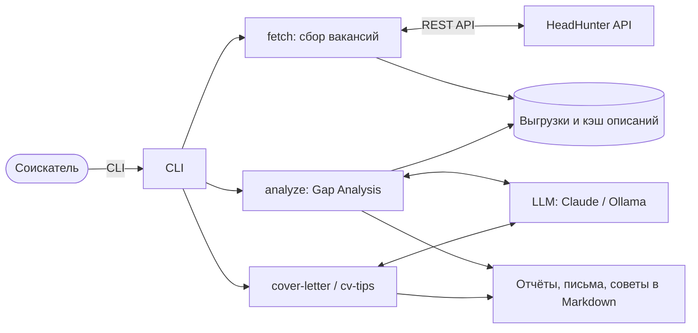
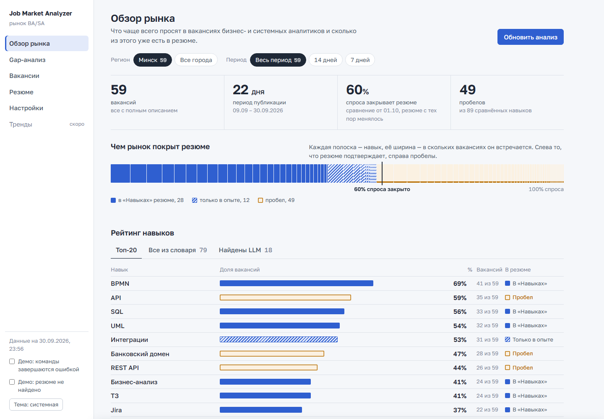
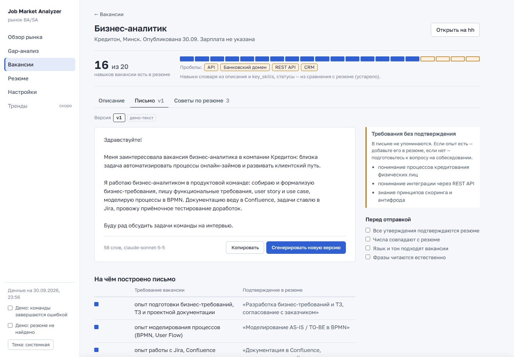

# Job Market Analyzer & Career Assistant

CLI-инструмент для соискателя на позицию бизнес/системного аналитика: собирает вакансии с HH.ru, показывает, какие навыки востребованы и каких не хватает в резюме, готовит черновики сопроводительных писем и советы по адаптации резюме под конкретную вакансию. Следующий шаг — локальный веб-интерфейс: для него готовы требования и [кликабельный прототип](#прототип-веб-интерфейса).

**Портфолио-проект бизнес/системного аналитика.** Код написан с ИИ-агентом [Claude Code](https://claude.com/claude-code); моя роль — аналитик и владелец продукта: требования, архитектурные решения, приёмка, контроль качества ответов LLM. Инструмент используется в моём собственном поиске работы.

**Статус:** все пять User Stories реализованы. US-01 — US-03 приняты; у US-04 и US-05 принята техническая часть, приёмка содержания отложена до новой версии Claude Haiku (на Sonnet проходит без замечаний) — см. [протоколы](#артефакты-аналитика). US-06 (веб-интерфейс) — требования и прототип готовы, реализация впереди.

## Задача

Поиск работы аналитика — это десятки вакансий с разными формулировками требований. Вручную сложно понять, какие навыки рынок просит чаще всего, чего не хватает в своём резюме и как под каждую вакансию написать письмо, не приписав себе лишнего.

**Бизнес-цель:** сократить время на анализ рынка и подготовку откликов, не жертвуя достоверностью — каждое утверждение в письме и совете должно подтверждаться резюме.

## Что умеет

| Что | Команда | Результат | User Story |
|---|---|---|---|
| Все настройки в одном файле: фильтры поиска, словарь навыков (88 навыков с синонимами), LLM, параметры писем | — | `profile/preferences.json` | US-01 |
| Выгрузка вакансий с HH.ru (инкрементально) и полных описаний | `fetch` | `data/raw_vacancies_{время}.json` | US-02 |
| Востребованные навыки рынка и сравнение с резюме (Gap Analysis) | `analyze` | `reports/market_skills_summary.md` | US-03 |
| Черновик сопроводительного письма под вакансию | `cover-letter <id>` | `reports/cover_letters/cl_{id}.md` | US-04 |
| До 5 советов, как назвать опыт из резюме словами вакансии | `cv-tips <id>` | `reports/cv_tips/cv_tips_{id}.md` | US-05 |
| Всё то же в браузере: экраны рынка, пробелов, вакансий, резюме и настроек, запуск команд — *в разработке, есть прототип* | `web` | локальный сервер на `127.0.0.1` | US-06 |



## Результаты

- **Рынок BA/SA в Минске** (59 вакансий, сентябрь 2026): топ навыков — BPMN (69%), API (59%), SQL (56%), UML (54%), интеграции (53%); покрытие резюме с учётом частоты навыков на рынке — отдельной метрикой в отчёте.
- **Стоимость:** анализ навыков — около 1 цента за запуск; письмо или советы по резюме — $0,01 (Claude Haiku 4.5) … $0,04–0,07 (Claude Sonnet 5.5) за вакансию.
- **Проверки ответов LLM кодом, а не доверием:** цитаты из резюме сверяются с файлом резюме, числа в советах — с резюме, термины — со словарём навыков; неподтверждённое отмечается ⚠️. Это защищает от главного риска LLM в резюме — приукрашивания опыта.
- **Сравнение моделей:** Claude Haiku 4.5 и Sonnet 5.5 сравнены на наборе приёмки по качеству и стоимости; три попытки дотянуть Haiku промптом и настройками задокументированы в протоколе US-04.

## Прототип веб-интерфейса

Кликабельный прототип будущего веб-интерфейса (US-06) — один файл [`docs/prototype/index.html`](docs/prototype/index.html): скачать и открыть в браузере, без установки и сервера. Построен на реальных данных проекта — 59 вакансий Минска из 8 выгрузок, рейтинг навыков и сравнение с резюме из отчёта, соответствие каждой вакансии резюме посчитано кодом `analyzer.py`. Тексты писем, советов и цитаты резюме — демо: резюме в репозиторий не попадает.





- **Экраны:** обзор рынка, Gap-анализ, вакансии и история выгрузок, карточка вакансии (описание, письмо и советы с версиями), резюме, настройки (поиск, словарь навыков с редактированием, модели LLM, письмо, подключения).
- **Запуск команд имитируется:** прогресс, лог с эквивалентной командой CLI, состояния «готово», «есть предупреждения», «ошибка», «отменено» — с теми же сообщениями, что у CLI.
- **Переключатели «Демо»** в левой панели показывают сценарии сбоя и отсутствия резюме; в продукт они не входят.
- **Процесс:** [бриф](docs/prototype/brief.md) → дизайн-план → прототип → два обзора с исправлениями по пунктам, каждое проверено автотестами в браузере → требования [US-06](requirements.md#us-06-локальный-веб-интерфейс-web-ui).

Фрагмент отчёта `analyze`:

| # | Навык | Вакансий | Доля |
|---|---|---|---|
| 1 | BPMN | 41 | 69% |
| 2 | API | 35 | 59% |
| 3 | SQL | 33 | 56% |
| 4 | UML | 32 | 54% |
| 5 | Интеграции | 31 | 53% |

## Артефакты аналитика

| Артефакт | Что внутри |
|---|---|
| [Требования](requirements.md) | Бизнес-цель, границы системы, 6 User Stories с 39 Acceptance Criteria, 5 нефункциональных требований, CLI, открытые вопросы, бэклог |
| [ADR-001: выбор LLM-провайдера](docs/adr/001-llm-provider.md) | Сравнение Claude, Ollama, DeepSeek, Qwen по качеству, стоимости и приватности резюме; решение по задачам |
| [ADR-002: кэш описаний вакансий](docs/adr/002-vacancy-details-cache.md) | Где хранить полные описания вакансий и почему отдельно от выгрузок |
| [Протокол приёмки US-01 — US-03](docs/testing/test-report-us01-03.md) | Тест-кейсы, дефекты и замечания, решение о приёмке |
| [Протокол приёмки US-04](docs/testing/test-report-us04.md) | Письма на Haiku и Sonnet, дефекты содержания, эксперименты с промптом, решение |
| [Протокол приёмки US-05](docs/testing/test-report-us05.md) | 16 тест-кейсов, замечания по Haiku, контрольный прогон на Sonnet, решение |
| [Прототип веб-интерфейса](docs/prototype/index.html) и [бриф](docs/prototype/brief.md) | Кликабельный прототип на реальных данных: 6 экранов, имитация запуска команд, пустые и ошибочные состояния, светлая и тёмная тема, мобильная вёрстка |
| [Руководство пользователя](docs/user-guide/index.md) | 11 глав: установка, настройки, каждая команда, типовой сценарий, частые проблемы, стоимость |
| [Промпты](prompts/) | Инструкции для LLM вынесены в файлы и правятся без изменения кода; отклонённые варианты — в `prompts/experiments/` |
| [Состояние проекта](docs/STATUS.md) | Что сделано, ключевые решения, данные, следующий шаг |

Всего в протоколах — 43 тест-кейса.

## Как велась разработка

- **Требования — до кода:** User Stories уточнялись в интервью по требованиям (в том числе через свой скилл Claude Code `requirements-interview`) и фиксировались в `requirements.md` с Acceptance Criteria.
- **По шагам:** каждый шаг реализации — совместная проверка результата и отдельный коммит.
- **Решения — в ADR,** отложенные договорённости — сразу в бэклог (раздел 9 требований), а не «в голове».
- **Приёмка по тест-кейсам** с протоколом: дефекты исправлялись по одному, после обсуждения.
- **Интерфейс — сначала прототипом:** бриф с референсами, дизайн-план на согласование, кликабельный прототип, обзоры с исправлениями по пунктам; требования US-06 написаны по итогам прототипа, а не до него.
- **Личные данные не в git:** резюме, выгрузки и отчёты исключены через `.gitignore`.
- **Правила работы агента — в скилле проекта** [`jma-dev`](.claude/skills/jma-dev/SKILL.md): структура, запуск команд (что платно и что перезаписывает данные), порядок изменений, проверки, правила документации и [чек-лист публикации](.claude/skills/jma-dev/publish-checklist.md) — секреты, личные данные, битые ссылки. Как пользоваться — [описание скилла](docs/claude-skill-jma-dev.md).

## Как запустить

Требуется Python 3.11+. Подробно, по шагам — [руководство: установка](docs/user-guide/getting-started.md).

```
python -m venv .venv
.venv\Scripts\activate
pip install -r requirements.txt
```

Скопировать `.env.example` в `.env` и заполнить ключи: `HH_USER_AGENT`, `HH_CLIENT_ID`, `HH_CLIENT_SECRET`, `HH_APP_TOKEN` (регистрация приложения на [dev.hh.ru](https://dev.hh.ru)), `ANTHROPIC_API_KEY`. Положить резюме в `profile/my_cv.md`, настроить фильтры в `profile/preferences.json`.

Типовой сценарий:

```
python -m src.cli fetch --region 16
python -m src.cli analyze --area Минск
python -m src.cli cover-letter 137587921
python -m src.cli cv-tips 137587921
```

`137587921` — ID вакансии, число из ссылки `hh.ru/vacancy/<ID>`. Параметры всех команд — в [руководстве](docs/user-guide/index.md).

## Стек

Python 3.11+, HeadHunter API, Claude API (Anthropic SDK), Ollama, Typer (CLI). Отчёты и письма — Markdown, оформленный под Obsidian.

## Структура проекта

```
job-market-analyzer/
├── data/                  # Выгрузки вакансий и кэши (не в git)
├── profile/               # preferences.json — настройки; my_cv.md — резюме (не в git)
├── docs/                  # ADR, протоколы приёмки, руководство пользователя, прототип веб-интерфейса, STATUS.md
├── prompts/               # Инструкции для LLM (письмо, советы по резюме)
├── reports/               # Отчёты, письма, советы (не в git)
├── scripts/               # Прогон писем на разных моделях (набор приёмки)
├── src/                   # Исходный код: cli, hh_client, analyzer, cover_letter, cv_tips, llm_service
├── requirements.md        # Требования: US, AC, NFR, бэклог
└── README.md
```

## Roadmap

- [x] US-01: Конфигурационный профиль
- [x] US-02: Сбор вакансий с HH.ru
- [x] US-03: Анализ рынка и Gap Analysis
- [x] US-04: Сопроводительные письма — реализовано; приёмка содержания отложена до новой версии Claude Haiku
- [x] US-05: Советы по адаптации резюме — реализовано; приёмка содержания отложена до новой версии Claude Haiku
- [ ] US-06: Локальный веб-интерфейс — требования и прототип готовы, реализация впереди
- [ ] Анализ трендов спроса на навыки во времени
- [ ] Живое сравнение DeepSeek и Qwen с Claude
- [ ] Сверка навыков, найденных LLM, со словарём (устранение ложных пробелов)

Полный список — в [бэклоге](requirements.md#9-бэклог-отложенные-задачи).
