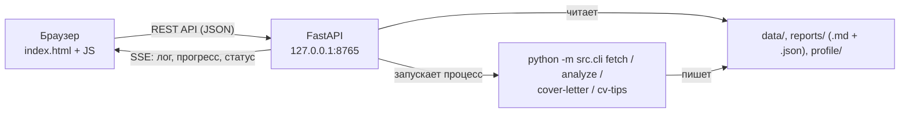

# ADR-003: Технология локального веб-интерфейса (US-06)

**Статус:** Принято
**Дата:** 08.10.2026 (до начала реализации US-06)
**Связанные требования:** US-06 (AC 6.1, AC 6.2, AC 6.7, AC 6.9, AC 6.10), NFR-2, NFR-3, открытый вопрос №5, бэклог п. 24, п. 28

## 1. Контекст

US-06 фиксирует, **что** делает веб-интерфейс: локальный сервер на `127.0.0.1`, один пользователь без авторизации, те же данные и функции, что у CLI. Требования не фиксируют, **на чём** он сделан. До реализации нужно принять три решения:

1. На чём писать сервер.
2. Как отдавать интерфейс в браузер.
3. Как выполнять долгие команды из браузера.

**Исходные условия:**
- **Прототип готов:** [docs/prototype/index.html](../prototype/index.html) — один HTML-файл на чистом JavaScript, без фреймворков; данные в нём пока «нарисованы».
- **Команды синхронные и долгие:** `fetch` с загрузкой описаний идёт минуты (пауза 3 сек на запрос, NFR-1), `analyze` с LLM — десятки секунд.
- **AC 6.2:** результат через интерфейс совпадает с той же командой в терминале; логика CLI не дублируется.
- **AC 6.7:** одна команда за раз, прогресс и лог во время выполнения, состояния «Готово / есть предупреждения / Ошибка / Отменено»; при отмене уже сохранённые файлы не меняются.
- **AC 6.9:** настройки проверяются перед записью (обязательные поля, диапазоны чисел).
- **AC 6.10, NFR-2:** значения ключей `.env` не попадают в браузер.
- **Сеть:** запросы к HH идут через curl вне VPN, Python — внутри VPN (Claude API). Локальный сервер на `127.0.0.1` эту схему не меняет.
- Зависимостей сейчас пять: `typer`, `requests`, `python-dotenv`, `anthropic`, `openai`.

## 2. Критерии выбора

1. **Соответствие AC 6.2 и AC 6.7** — совпадение с CLI, прогресс, надёжная отмена.
2. **Объём своего кода** — меньше ручной работы с маршрутами, JSON, ошибками и проверкой данных.
3. **Зависимости** — чем меньше, тем лучше, но не ценой большого объёма кода.
4. **Переиспользование прототипа** — экраны уже согласованы.
5. **Ценность для портфолио** — проект показывает работу аналитика; решение должно давать артефакты, о которых можно рассказать на интервью.

## 3. Рассмотренные варианты

### 3.1. Сервер

#### `http.server` (стандартная библиотека Python)

- ➕ Ноль зависимостей.
- ➖ Маршрутизация, разбор JSON, коды ошибок, потоки, передача прогресса — всё вручную; кода и ошибок больше.
- ➖ Проверку настроек (AC 6.9) писать с нуля.

#### Flask

- ➕ Одна зависимость, самый простой код, зрелая библиотека.
- ➕ Передача прогресса — потоковый ответ-генератор.
- ➖ Проверка настроек — вручную.
- ➖ Описание API нужно вести отдельно, руками.

#### FastAPI ✅

- ➕ Проверка входных данных через модели pydantic — правила AC 6.9 описываются декларативно.
- ➕ **OpenAPI-спецификация и Swagger UI генерируются автоматически** по коду — документация API всегда актуальна.
- ➕ Потоковые ответы (SSE) поддерживаются штатно.
- ➖ Две-три новые зависимости (`fastapi`, `uvicorn`, транзитивно `pydantic`, `starlette`).
- ➖ Асинхронная модель — но сами команды остаются синхронными и выполняются отдельным процессом (3.3), поэтому async нужен только в тонком слое сервера.

**Аргумент портфолио.** API (59% вакансий Минска), REST, Swagger, OpenAPI — одни из главных пробелов резюме по отчёту `analyze`. С FastAPI аналитик проектирует REST API собственного продукта (ресурсы, методы, коды ответов, модели данных), а спецификация OpenAPI и Swagger UI становятся артефактом портфолио.

### 3.2. Интерфейс

#### Шаблоны на сервере (Jinja)

Сервер собирает готовую HTML-страницу с данными.

- ➕ Меньше JavaScript.
- ➖ Прототип придётся разбирать на шаблоны.
- ➖ Отдельного API нет — интерфейс и данные смешаны.

#### Статические файлы + JSON API ✅

Сервер отдаёт страницу один раз, дальше страница запрашивает данные и запускает команды через REST API в формате JSON.

- ➕ Прототип переносится почти как есть: «нарисованные» данные заменяются запросами к API.
- ➕ Разделение frontend / backend с явным контрактом (OpenAPI).
- ➕ Совпадает с AC 6.2: команды уже будут сохранять рядом с Markdown машиночитаемый `.json` (бэклог, п. 24), API его просто отдаёт.
- ➖ Логика отображения — на JavaScript.

### 3.3. Долгие команды

#### Поток внутри сервера вызывает функции

- ➕ Нет отдельного процесса.
- ➖ **Поток в Python нельзя остановить снаружи:** для отмены (AC 6.7) пришлось бы встраивать флаги отмены в `fetch`, `analyze`, `cover-letter`, `cv-tips`.
- ➖ Лог нужно перехватывать из общего логгера сервера; состояние команды и сервера общее.

#### Очередь задач (Celery, RQ)

- ➖ Брокер сообщений, воркеры, новые зависимости — избыточно для однопользовательского локального инструмента.

#### Отдельный процесс `python -m src.cli <команда>` ✅

Сервер запускает ту же команду, что пользователь набирает в терминале, как дочерний процесс.

- ➕ **Совпадение с CLI гарантировано** (AC 6.2): выполняется буквально та же команда с теми же проверками и сообщениями.
- ➕ **Отмена надёжная:** процесс завершается.
- ➕ Лог — это вывод процесса: строки передаются в браузер по мере появления (SSE), прогресс разбирается из строк вида `Описания: 10/12`.
- ➕ «Одна команда за раз» — сервер просто не запускает второй процесс, пока жив первый.
- ➖ Прерванный процесс может оставить недописанный файл — см. раздел 5.
- ➖ Прогресс зависит от формата строк лога — формат нужно держать стабильным.

### 3.4. Передача прогресса в браузер

- **Опрос (polling)** — браузер раз в секунду спрашивает статус. Просто, но лог приходит рывками.
- **WebSocket** — двусторонний канал; нам двусторонняя связь не нужна.
- **Server-Sent Events (SSE)** ✅ — односторонний поток событий от сервера, штатно поддерживается браузером (`EventSource`) и FastAPI.

## 4. Решение

**FastAPI + статические файлы с JSON API + команды отдельным процессом + прогресс через SSE.**

| Слой | Решение | Закрывает |
|---|---|---|
| Сервер | FastAPI + uvicorn, только `127.0.0.1` | AC 6.1, AC 6.9 (pydantic), NFR-3 |
| Интерфейс | Статические файлы из прототипа + REST API в JSON | AC 6.2–6.6, AC 6.8 |
| Команды | Дочерний процесс `python -m src.cli …`, одна за раз | AC 6.2, AC 6.7 |
| Прогресс | SSE | AC 6.7 |
| Ключи | API отдаёт только статус «задан / не задан» | AC 6.10, NFR-2 |

**Context7 (бэклог, п. 28)** — оценён 08.10.2026, не ставим: скилл не текстовый, а запускает npm-пакет `ctx7` через `npx` (выполнение кода из интернета, предупреждения Socket и Snyk в каталоге), телеметрия по умолчанию включена, а правило личной библиотеки скиллов (`disable-model-invocation`) лишает его смысла — он полезен, только когда агент обращается к нему сам. Вместо него при реализации — официальная документация FastAPI и закреплённые версии в `requirements.txt`. Вернуться, если упрёмся в устаревший API; сначала — разовый пробный запуск с `CTX7_TELEMETRY_DISABLED=1`.

## 5. Последствия

**Положительные:**
- Поведение интерфейса и CLI совпадает по построению, а не по договорённости.
- Отмена команды не требует правок в модулях `fetch`, `analyze`, `cover-letter`, `cv-tips`.
- Прототип переиспользуется; экраны уже согласованы.
- OpenAPI-спецификация и Swagger UI (`/docs`) — документация API и артефакт портфолио.

**Отрицательные и что с ними делаем:**
- **Недописанные файлы при отмене.** Описания вакансий уже пишутся атомарно — через временный файл и замену (ADR-002). **Сделано 08.10.2026:** все записи файлов идут через `write_text_atomic` (`src/file_utils.py`) — выгрузки, описания, кэш LLM, отчёт `analyze`, письма и советы; временный файл `<имя>.tmp` не сбивает поиск выгрузок и нумерацию версий. Будущий `.json` рядом с отчётами (п. 24) пишется так же.
- **Прогресс завязан на строки лога.** Строки прогресса (`Страница …`, `Описания: N/M`, `LLM: пакет N/M`) фиксируются как формат; при их изменении — проверить разбор в интерфейсе.
- **Новые зависимости:** `fastapi`, `uvicorn` — версии закрепляются в `requirements.txt`.
- **Нужны машиночитаемые результаты** — бэклог, п. 24 (`.json` рядом с отчётами) становится первым шагом реализации US-06.
- **Проект API** (ресурсы, методы, модели, коды ответов) — отдельный артефакт до кода: спецификация по экранам прототипа и AC 6.3–6.11.

## 6. Связанные документы

- [requirements.md](../../requirements.md) — US-06 (AC 6.1–6.12), NFR-3, открытый вопрос №5, бэклог п. 24, п. 28
- [docs/prototype/](../prototype/README.md) — кликабельный прототип и бриф
- [ADR-002](002-vacancy-details-cache.md) — атомарная запись описаний вакансий

## 7. Источники

- [Context7 CLI — документация](https://context7.com/docs/clients/cli)
- [context7-cli на skills.sh](https://skills.sh/upstash/context7/context7-cli)
