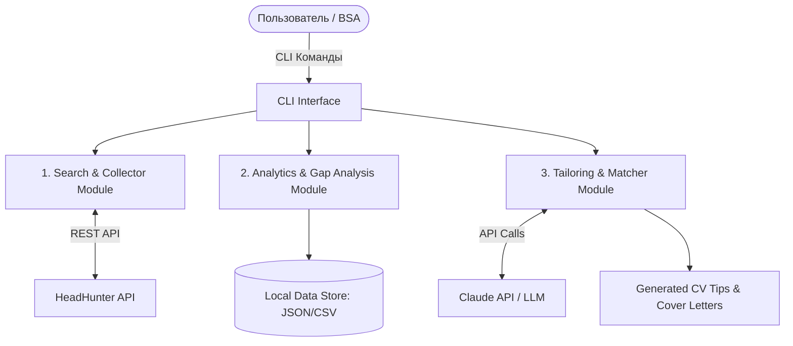

# Requirements Specification: Job Market Analyzer & Career Assistant (`job-market-analyzer`)

## 1. Общие сведения
* **Наименование проекта:** `job-market-analyzer`
* **Роль разработчика:** Бизнес-системный аналитик (БСА)
* **Основной стек:** Python 3.11+, HeadHunter API v1, Claude API (Anthropic SDK), Click/Typer (CLI интерфейс)

---

## 2. Бизнес-цель и Назначение
**Бизнес-цель:** Сократить время на поиск релевантных вакансий и подготовку качественных откликов (CV/Cover Letter) для позиции Бизнес- / Системный аналитик в регионе РФ и РБ, а также закрыть двухлетний перерыв в работе демонстрацией практического кейса автоматизации.

**Основные задачи:**
1. Автоматизировать сбор и первичный фильтр вакансий с платформы HeadHunter.
2. Провести агрегированный анализ ключевых навыков и технологий (Gap Analysis) на основе требований рынка.
3. Автоматизировать генерацию персонализированных сопроводительных писем и рекомендаций по адаптации резюме под конкретные вакансии.

---

## 3. Архитектура и Границы Системы (Scope)



## 4. Пользовательские истории (User Stories & Acceptance Criteria)
### US-01: Сбор вакансий с HH.ru (Search & Fetch)
> **Как** *Бизнес-системный аналитик,*  
> **Я хочу** *выгружать актуальные вакансии с hh.ru по заданным критериям (должность, регион, опыт),*  
> **Чтобы** *иметь актуальную локальную базу релевантных предложений.*

**Acceptance Criteria (AC):**

1. **AC 1.1:** Система осуществляет поиск по ключевым словам: `"Бизнес-аналитик"`, `"Системный аналитик"`, `"Business Analyst"`, `"Systems Analyst"`.
2. **AC 1.2:** Фильтрация поддерживается по регионам: Россия (ID: 113), Беларусь (ID: 16), или конкретные города (Москва, Минск и др.).
3. **AC 1.3:** Результаты выгрузки сохраняются локально в формате `data/raw_vacancies_{timestamp}.json`.
4. **AC 1.4:** Для каждой вакансии сохраняются параметры: `id`, `name`, `salary`, `area`, `employer`, `requirement`, `responsibility`, `alternate_url`, `published_at`.

### US-02: Агрегированный анализ навыков (Market Gap Analysis)
> **Как** *Бизнес-системный аналитик,*  
> **Я хочу** *получать отчет по самым востребованным хард-скилам из собранных вакансий и сравнивать их со своим резюме,*  
> **Чтобы** *определить свои слабые стороны (gaps) и подтянуть их.*

**Acceptance Criteria (AC):**

1. **AC 2.1:** Модуль парсит ключевые термины из текста требований вакансий (SQL, UML, BPMN, REST API, JSON, Swagger, Postman, Python, Agile, Scrum и т.д.).
2. **AC 2.2:** Формируется итоговый Markdown-отчет `reports/market_skills_summary.md` с топом ключевых навыков и частотой их упоминания (в % от общего количества вакансий).
3. **AC 2.3:** При предоставлении локального файла резюме (`profile/my_cv.md`), система подсвечивает пересечения и недостающие навыки в формате таблицы:

| Навык | Частота на рынке | Наличие в резюме | Статус |
|---|---|---|---|
| SQL / PostgreSQL | 82% | Да | ✅ Matches |
| REST API & Swagger | 75% | Да | ✅ Matches |
| Kafka / AsyncAPI | 45% | Нет | ⚠️ Gap to address |

### US-03: Генерация адаптированного сопроводительного письма (Cover Letter Tailoring)
> **Как** *соискатель,*  
> **Я хочу** *генерировать персонализированное сопроводительное письмо по конкретному ID вакансии,*  
> **Чтобы** *повысить конверсию откликов в приглашения на интервью.*

**Acceptance Criteria (AC):**

1. **AC 3.1:** Команда принимает на вход `vacancy_id`.
2. **AC 3.2:** Инструмент запрашивает у Claude API генерацию сопроводительного письма на основе полного описания вакансии и файла `profile/my_cv.md`.
3. **AC 3.3:** Письмо должно содержать:
   - Короткое приветствие.
   - Акцент на наиболее подходящем опыте из резюме под конкретные задачи из вакансии.
   - Вежливое предложение провести интервью / обсудить детали.
4. **AC 3.4:** Готовый текст сохраняется в `reports/cover_letters/cl_{vacancy_id}.md`.

### US-04: Рекомендации по корректировке резюме (CV Tailoring)
> **Как** *соискатель,*  
> **Я хочу** *получать рекомендации по изменению формулировок в резюме под целевую вакансию,*  
> **Чтобы** *пройти первичный скрининг HR / ATS-систем.*

**Acceptance Criteria (AC):**

1. **AC 4.1:** Система выводит список из 3–5 конкретных советов, какие результаты работы или термины из вакансии стоит добавить в блок опыта.

---

## 5. Нефункциональные требования (NFR)
1. **NFR-1 (Производительность):** Запросы к API HeadHunter должны соблюдать rate limits (задержки между запросами не менее 0.25 сек).
2. **NFR-2 (Безопасность):** API-ключи (Anthropic API Key) должны храниться исключительно в файле `.env` и не попадать в публичный репозиторий Git.
3. **NFR-3 (Удобство использования):** Взаимодействие с системой осуществляется через CLI с помощью параметров (аргументов командной строки).
4. **NFR-4 (Качество кода & Документация):** Код должен содержать docstrings, логирование ошибок и понятный `README.md` с инструкцией по запуску.

---

## 6. Структура Директорий Проекта

```
job-market-analyzer/
├── data/                  # Локальные данные вакансий (JSON/CSV)
├── profile/               # Профиль пользователя (my_cv.md, preferences.json)
├── reports/               # Сгенерированные отчеты и сопроводительные письма
│   └── cover_letters/
├── src/                   # Исходный код
│   ├── __init__.py
│   ├── hh_client.py       # Интеграция с API HH.ru
│   ├── analyzer.py        # Модуль парсинга навыков и Gap-анализа
│   ├── llm_service.py     # Интеграция с Claude API
│   └── cli.py             # Интерфейс командной строки
├── .env.example           # Шаблон конфига с переменными окружения
├── requirements.md        # Текущий файл ТЗ
├── requirements.txt       # Зависимости Python
└── README.md              # Документация и инструкция по запуску
```
