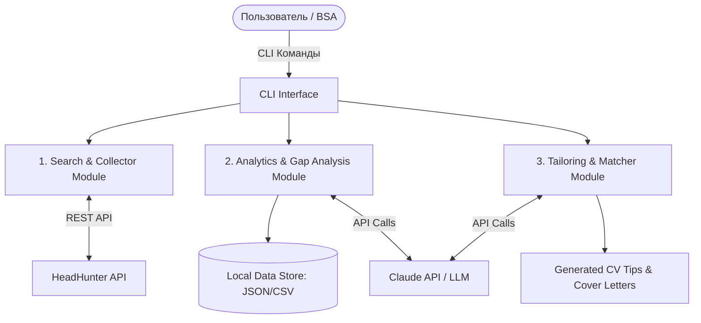

# Requirements Specification: Job Market Analyzer & Career Assistant (`job-market-analyzer`)

## 1. Общие сведения
* **Наименование проекта:** `job-market-analyzer`
* **Роль разработчика:** Бизнес-системный аналитик (БСА)
* **Основной стек:** Python 3.11+, HeadHunter API v1, Claude API (Anthropic SDK) — LLM-провайдер по умолчанию, OpenAI-совместимые провайдеры (DeepSeek, Qwen, Ollama) — опционально (см. [ADR-001](docs/adr/001-llm-provider.md)), Click/Typer (CLI интерфейс)

---

## 2. Бизнес-цель и Назначение
**Бизнес-цель:** Сократить время на поиск релевантных вакансий и подготовку качественных откликов (CV/Cover Letter) для позиции Бизнес- / Системный аналитик в регионе РФ и РБ, а также закрыть двухлетний перерыв в работе демонстрацией практического кейса автоматизации.

**Основные задачи:**
1. Автоматизировать сбор и первичный фильтр вакансий с платформы HeadHunter.
2. Провести агрегированный анализ ключевых навыков и технологий (Gap Analysis) на основе требований рынка.
3. Автоматизировать генерацию персонализированных сопроводительных писем и рекомендаций по адаптации резюме под конкретные вакансии.

**Предпосылки:**
* Файл `profile/my_cv.md` должен быть актуализирован под текущие реалии до реального использования US-03/US-04/US-05. Обновление резюме — отдельная задача вне кода проекта, но она блокирует полноценную проверку этих user stories.

---

## 3. Архитектура и Границы Системы (Scope)



## 4. Пользовательские истории (User Stories & Acceptance Criteria)
### US-01: Настройка профиля поиска и предпочтений (Configuration Profile)
> **Как** *Бизнес-системный аналитик,*  
> **Я хочу** *задать параметры поиска вакансий, словарь навыков для анализа и инструкции для генерации откликов в одном конфигурационном файле,*  
> **Чтобы** *не вводить одни и те же значения вручную при каждом запуске CLI-команд и иметь единый источник настроек для всех модулей.*

**Acceptance Criteria (AC):**

1. **AC 1.1:** Файл `profile/preferences.json` содержит блок `search_settings` — фильтры для HeadHunter API (целевые роли, регионы, формат работы, опыт). Модуль `hh_client.py` использует эти параметры по умолчанию при выгрузке вакансий (US-02, AC 2.1, AC 2.2, AC 2.5).
2. **AC 1.2:** Файл содержит блок `analytical_skills_dictionary` — настраиваемый словарь ключевых навыков в формате `{навык: [синонимы]}`, например `"REST API": ["REST", "RESTful"]`; поддерживается и простой список навыков без синонимов. Модуль `analyzer.py` ищет навык и его синонимы в текстах вакансий и учитывает их как один навык при проведении Gap-анализа (US-03, AC 3.1). Английские термины ищутся целым словом (`Git` не находится внутри `GitLab`), русские — по основе слова, чтобы учитывались падежные формы (синоним `"техническ задани"` находит «технических заданий»).
3. **AC 1.3:** Файл содержит блок `llm_preferences` — вводные инструкции для Claude API: в каком тоне писать сопроводительные письма и на каких блоках опыта делать акцент (US-04, AC 4.5).
4. **AC 1.4:** Файл создаётся и редактируется пользователем вручную. При отсутствии файла или отдельных полей используются значения по умолчанию, зафиксированные в соответствующих AC.
5. **AC 1.5:** Блок `llm_preferences` содержит `llm_providers` — LLM-провайдера и модель отдельно для двух типов задач: `vacancy_analysis` (выявление навыков в вакансиях, US-03, AC 3.1) и `cv_processing` (все запросы, где в модель передаётся резюме: AC 3.3, US-04, US-05). Поддерживаемые `provider`: `anthropic` (Anthropic SDK), `deepseek`, `qwen`, `ollama` (OpenAI-совместимый клиент); адрес сервера провайдера можно переопределить параметром `base_url`. По умолчанию обе задачи используют `anthropic` / `claude-haiku-4-5`. Рекомендуемая альтернативная конфигурация: вакансии — в дешёвую модель (DeepSeek, Qwen), резюме — в Claude или локальную модель Ollama, чтобы персональные данные не передавались провайдерам с менее прозрачной обработкой данных. Обоснование выбора — [ADR-001](docs/adr/001-llm-provider.md).

**Пример структуры файла:**
```json
{
  "search_settings": {
    "target_roles": ["Бизнес-аналитик", "Системный аналитик", "Business Analyst", "Systems Analyst"],
    "regions": [{"id": 113, "name": "Россия"}, {"id": 16, "name": "Беларусь"}],
    "experience_level": ["between1And3", "between3And6", "moreThan6"],
    "employment_type": "full",
    "schedule": ["remote", "office", "hybrid"],
    "currency": "RUR",
    "min_salary": null,
    "exclude_words": ["1С"],
    "initial_period_days": 14,
    "request_delay_sec": 3
  },
  "analytical_skills_dictionary": {
    "SQL": [], "PostgreSQL": ["Postgres"], "UML": [], "BPMN": [],
    "REST API": ["REST", "RESTful"], "SOAP": [], "JSON": [], "XML": ["XSD"],
    "Swagger": [], "Postman": [], "Kafka": ["Кафк"], "Agile": [], "Scrum": [],
    "ТЗ": ["техническ задани"]
  },
  "llm_preferences": {
    "cover_letter_language": "ru",
    "tone": "professional_and_enthusiastic",
    "focus_areas": ["Интеграции и API", "Проектирование баз данных", "Сбор и документирование требований"],
    "llm_providers": {
      "vacancy_analysis": {"provider": "anthropic", "model": "claude-haiku-4-5"},
      "cv_processing": {"provider": "anthropic", "model": "claude-haiku-4-5"}
    }
  }
}
```

### US-02: Сбор вакансий с HH.ru (Search & Fetch)
> **Как** *Бизнес-системный аналитик,*  
> **Я хочу** *выгружать актуальные вакансии с hh.ru по заданным критериям (должность, регион, опыт),*  
> **Чтобы** *иметь актуальную локальную базу релевантных предложений.*

**Acceptance Criteria (AC):**

1. **AC 2.1:** Система осуществляет поиск по ключевым словам из `target_roles` в `search_settings` (`profile/preferences.json`); по умолчанию — `"Бизнес-аналитик"`, `"Системный аналитик"`, `"Business Analyst"`, `"Systems Analyst"`. Поиск идёт по названию вакансии (`search_field=name`), все роли объединяются в один запрос через `OR`, слова из `exclude_words` исключаются через `NOT` (например, `1С`), результаты дедуплицируются по `id`. CLI-аргумент переопределяет значение из файла.
2. **AC 2.2:** Фильтрация по регионам поддерживается через `regions` в `search_settings` (`profile/preferences.json`); по умолчанию — Россия (ID: 113), Беларусь (ID: 16), или конкретные города (Москва, Минск и др.). CLI-аргумент переопределяет значение из файла.
3. **AC 2.3:** Результаты выгрузки сохраняются локально в формате `data/raw_vacancies_{timestamp}.json`.
4. **AC 2.4:** Для каждой вакансии сохраняются параметры: `id`, `name`, `salary`, `area`, `employer`, `requirement`, `responsibility`, `alternate_url`, `published_at`.
5. **AC 2.5:** Дополнительные фильтры поиска поддерживаются согласно `search_settings` из `profile/preferences.json`: опыт работы (`experience_level` — одно значение или список: `noExperience` / `between1And3` / `between3And6` / `moreThan6`; передаётся в параметр HH `experience`), тип занятости (`employment_type`: `full` / `part` / `project` → параметр HH `employment_form`: `FULL` / `PART` / `PROJECT`), формат работы (`schedule` — список значений: `office` / `hybrid` / `remote` → параметр HH `work_format`: `ON_SITE` / `HYBRID` / `REMOTE`), минимальная зарплата (`min_salary`) и валюта (`currency`). HH отдаёт не более 2000 вакансий на один поиск: если найдено больше, запрос автоматически разбивается по регионам, затем по уровням опыта. Явные CLI-аргументы имеют приоритет над значениями по умолчанию из файла.
6. **AC 2.6:** Глубина поиска зависит от истории выгрузок: при первом запуске (в `data/` ещё нет файлов `raw_vacancies_*.json`) выгружаются вакансии за последние `initial_period_days` дней (по умолчанию 14, задаётся в `search_settings`). При последующих запусках выгружаются вакансии с момента последней выгрузки (поле `fetched_at` самого свежего файла) с запасом в 1 час, поэтому пропуск нескольких дней не приводит к потере вакансий. Глубина поиска ограничена 30 днями (максимум HH API). Использованные `period_days` / `date_from` сохраняются в файле выгрузки.
7. **AC 2.7:** После поиска для каждой вакансии, которой ещё нет в кэше, загружаются полное описание и `key_skills` через `GET /vacancies/{id}` (с паузой `request_delay_sec`, NFR-1). Результат сохраняется в кэш `data/details/{id}.json` (поля: `id`, `description` — список абзацев без HTML в формате Markdown: подзаголовки `**жирным**`, пункты списков через `- `; `key_skills` — список названий; `fetched_at`); уже загруженные вакансии повторно не запрашиваются. Ошибка загрузки одной вакансии логируется и не прерывает выгрузку, а при следующем запуске `fetch` загрузка повторяется. Флаг `--no-details` отключает этот этап.

### US-03: Агрегированный анализ навыков (Market Gap Analysis)
> **Как** *Бизнес-системный аналитик,*  
> **Я хочу** *получать отчет по самым востребованным хард-скилам из собранных вакансий и сравнивать их со своим резюме,*  
> **Чтобы** *определить свои слабые стороны (gaps) и подтянуть их.*

**Acceptance Criteria (AC):**

1. **AC 3.1:** Модуль извлекает навыки из текста вакансий гибридным способом:
   - источник текста — полное описание и `key_skills` из кэша `data/details/{id}.json` (US-02, AC 2.7); если вакансии нет в кэше — сниппеты `requirement` / `responsibility`;
   - базовое сопоставление по словарю терминов из `analytical_skills_dictionary` в `profile/preferences.json` (SQL, UML, BPMN, REST API, JSON, Swagger, Postman, Python, Agile, Scrum и т.д.), который можно пополнять без изменения кода, плюс навыки из `key_skills`;
   - довыявление навыков, не покрытых словарём, через запрос к Claude API по тексту вакансии. Результат извлечения кэшируется по `id` вакансии в `data/llm_skills_cache.json`, поэтому каждая вакансия отправляется в Claude API только один раз.
2. **AC 3.2:** Формируется итоговый Markdown-отчет `reports/market_skills_summary.md` с топом ключевых навыков и частотой их упоминания (в % от общего количества проанализированных вакансий; навык учитывается не более одного раза на вакансию). В шапке отчёта указываются: период публикации вакансий, количество вакансий и сколько из них проанализировано по полному описанию, а сколько — по сниппетам.
3. **AC 3.3:** При предоставлении локального файла резюме (`profile/my_cv.md`), система через Claude API семантически сопоставляет навыки из отчёта с текстом резюме (учитывая синонимы и вариации формулировок, например `Postgres` / `PostgreSQL`) и подсвечивает пересечения и недостающие навыки в формате таблицы:

| Навык | Частота на рынке | Наличие в резюме | Статус |
|---|---|---|---|
| SQL / PostgreSQL | 82% | Да | ✅ Matches |
| REST API & Swagger | 75% | Да | ✅ Matches |
| Kafka / AsyncAPI | 45% | Нет | ⚠️ Gap to address |

4. **AC 3.4:** По умолчанию анализируются все файлы `data/raw_vacancies_*.json`, объединённые с дедупликацией по `id` (при повторах берётся запись из самого свежего файла). Опция `--data` задаёт один конкретный файл вместо объединения. Опция `--days N` ограничивает анализ вакансиями, опубликованными за последние N дней (по `published_at`); без неё анализируются все накопленные вакансии. Опция `--area` ограничивает анализ вакансиями одного региона по названию (например, `"Минск"`). Применённые фильтры указываются в шапке отчёта.

### US-04: Генерация адаптированного сопроводительного письма (Cover Letter Tailoring)
> **Как** *соискатель,*  
> **Я хочу** *генерировать персонализированное сопроводительное письмо по конкретному ID вакансии,*  
> **Чтобы** *повысить конверсию откликов в приглашения на интервью.*

**Acceptance Criteria (AC):**

1. **AC 4.1:** Команда принимает на вход `vacancy_id`. Данные по вакансии сначала ищутся локально в уже сохранённых файлах `data/raw_vacancies_*.json`; если вакансия не найдена — выполняется прямой запрос к HH API по этому ID.
2. **AC 4.2:** Инструмент запрашивает у Claude API генерацию сопроводительного письма на основе полного описания вакансии и файла `profile/my_cv.md`.
3. **AC 4.3:** Письмо должно содержать:
   - Короткое приветствие.
   - Акцент на наиболее подходящем опыте из резюме под конкретные задачи из вакансии.
   - Вежливое предложение провести интервью / обсудить детали.
4. **AC 4.4:** Готовый текст сохраняется в `reports/cover_letters/cl_{vacancy_id}.md`.
5. **AC 4.5:** Язык, тон и смысловые акценты письма задаются через `llm_preferences` в `profile/preferences.json` (`cover_letter_language`, `tone`, `focus_areas`); при отсутствии файла используются значения по умолчанию (русский язык, профессиональный тон).

### US-05: Рекомендации по корректировке резюме (CV Tailoring)
> **Как** *соискатель,*  
> **Я хочу** *получать рекомендации по изменению формулировок в резюме под целевую вакансию,*  
> **Чтобы** *пройти первичный скрининг HR / ATS-систем.*

**Acceptance Criteria (AC):**

1. **AC 5.1:** Команда принимает на вход `vacancy_id`. Данные по вакансии ищутся так же, как в US-04 (AC 4.1): сначала локально в `data/raw_vacancies_*.json`, при отсутствии — прямой запрос к HH API по ID.
2. **AC 5.2:** Инструмент запрашивает у Claude API сравнение текста `profile/my_cv.md` с описанием конкретной вакансии и формирует список из 3–5 конкретных советов, какие результаты работы или термины из вакансии стоит добавить в блок опыта.
3. **AC 5.3:** Результат сохраняется в `reports/cv_tips_{vacancy_id}.md`.

---

## 5. Нефункциональные требования (NFR)
1. **NFR-1 (Производительность):** Запросы к API HeadHunter должны соблюдать rate limits: пауза между запросами по умолчанию 3 сек, настраивается через `request_delay_sec` в `search_settings` (`profile/preferences.json`). При ответах 429/503 или сетевом сбое — до 3 повторов с увеличивающейся паузой (10, 20, 30 сек).
2. **NFR-2 (Безопасность):** API-ключи (`ANTHROPIC_API_KEY`; `DEEPSEEK_API_KEY`, `DASHSCOPE_API_KEY` — при использовании этих провайдеров; `HH_CLIENT_ID`, `HH_CLIENT_SECRET`, `HH_APP_TOKEN`) должны храниться исключительно в файле `.env` и не попадать в публичный репозиторий Git. Резюме (`profile/my_cv.md`) передаётся только провайдеру, заданному для `cv_processing` (AC 1.5).
3. **NFR-3 (Удобство использования):** Взаимодействие с системой осуществляется через CLI с помощью параметров (аргументов командной строки).
4. **NFR-4 (Качество кода & Документация):** Код должен содержать docstrings, логирование ошибок и понятный `README.md` с инструкцией по запуску.

---

## 6. Структура Директорий Проекта

```
job-market-analyzer/
├── docs/
│   └── adr/               # Архитектурные решения (ADR)
├── data/                  # Локальные данные вакансий (JSON/CSV)
│   └── details/           # Кэш полных описаний вакансий ({id}.json)
├── profile/               # Профиль пользователя (my_cv.md, preferences.json)
├── reports/               # Сгенерированные отчеты и сопроводительные письма
│   └── cover_letters/
├── src/                   # Исходный код
│   ├── __init__.py
│   ├── config.py          # Загрузка profile/preferences.json и значения по умолчанию
│   ├── hh_client.py       # Интеграция с API HH.ru
│   ├── analyzer.py        # Модуль парсинга навыков и Gap-анализа
│   ├── llm_service.py     # Интеграция с LLM: Claude API и OpenAI-совместимые провайдеры
│   └── cli.py             # Интерфейс командной строки
├── .env.example           # Шаблон конфига с переменными окружения
├── requirements.md        # Текущий файл ТЗ
├── requirements.txt       # Зависимости Python
└── README.md              # Документация и инструкция по запуску
```

---

## 7. CLI-команды

Взаимодействие с системой — через команды в терминале (`python -m src.cli <команда> [опции]` из корня проекта), реализовано на Click/Typer (NFR-3). Значения опций по умолчанию берутся из `profile/preferences.json` (US-01), явно переданные опции их переопределяют.

| Команда | Назначение (US) | Аргументы / опции | Результат |
|---|---|---|---|
| `fetch` | Сбор вакансий с HH.ru (US-02) | `--role`, `--region` (ID региона HH), `--experience`, `--employment`, `--schedule` (все, кроме `--min-salary`, можно указывать несколько раз), `--min-salary` — необязательные, переопределяют `search_settings`; `--no-details` — не загружать полные описания | `data/raw_vacancies_{timestamp}.json`, `data/details/{id}.json` |
| `analyze` | Агрегированный Gap Analysis (US-03) | `--data` — необязательный путь к одному файлу вакансий; по умолчанию объединяются все файлы из `data/`; `--days N` — только вакансии за последние N дней; `--area` — только вакансии региона (например, `"Минск"`) | `reports/market_skills_summary.md` |
| `cover-letter <vacancy_id>` | Генерация сопроводительного письма (US-04) | `vacancy_id` — обязательный позиционный аргумент | `reports/cover_letters/cl_{vacancy_id}.md` |
| `cv-tips <vacancy_id>` | Советы по адаптации резюме (US-05) | `vacancy_id` — обязательный позиционный аргумент | `reports/cv_tips_{vacancy_id}.md` |

**Пример типового сценария:**
```
python -m src.cli fetch
python -m src.cli analyze
python -m src.cli cover-letter 123456789
python -m src.cli cv-tips 123456789
```

---

## 8. Открытые вопросы

1. ~~**Доступ к HH API**~~ — **решено:** без авторизации `/vacancies` возвращает 403, поэтому приложение зарегистрировано на dev.hh.ru; запросы идут с токеном приложения (`HH_APP_TOKEN`, получен по `client_credentials`). HH блокирует IP VPN-сервисов, поэтому запросы к HH выполняются через `curl` (путь в `HH_CURL_PATH`), исключённый из VPN, а остальной трафик (включая Claude API) остаётся в VPN.
2. ~~**Накопление данных**~~ — **решено:** `analyze` объединяет все файлы `data/raw_vacancies_*.json` с дедупликацией по `id`, опция `--days N` ограничивает анализ свежими вакансиями (US-03, AC 3.4). Анализ трендов во времени в US-03 не входит — вынесен в бэклог.
3. **Отказоустойчивость и стоимость LLM-вызовов** — **частично решено:** стоимость контролируется выбором провайдера и модели по задачам (AC 1.5, [ADR-001](docs/adr/001-llm-provider.md)) и кэшированием результатов по `id` вакансии (AC 3.1). Открыто: политика повторных попыток при сбоях LLM-провайдеров и поведение при исчерпании лимитов/баланса — определить при реализации `llm_service.py`.
4. ~~**Полнота текста для Gap-анализа (US-03)**~~ — **решено:** поиск HH возвращает только сниппеты `requirement` / `responsibility` (~330 символов, часто обрезаны), поэтому `fetch` догружает полные описания и `key_skills` через `GET /vacancies/{id}` с кэшем в `data/details/` (US-02, AC 2.7). Первая загрузка — около 45 мин (~900 вакансий × 3 сек), последующие — только новые вакансии. Загрузка выполняется в `fetch`, а не в `analyze`, чтобы работа с HH оставалась в модуле сбора, а анализ работал офлайн по кэшу.
