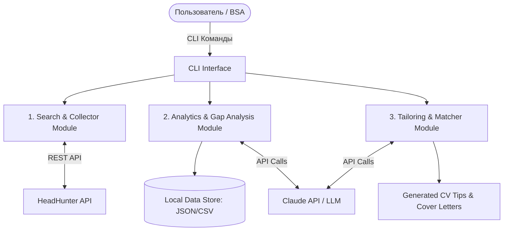

# Requirements Specification: Job Market Analyzer & Career Assistant (`job-market-analyzer`)

## 1. Общие сведения
* **Наименование проекта:** `job-market-analyzer`
* **Роль разработчика:** Бизнес-системный аналитик (БСА)
* **Основной стек:** Python 3.11+, HeadHunter API v1, Claude API (Anthropic SDK) — LLM-провайдер по умолчанию, OpenAI-совместимые провайдеры (DeepSeek, Qwen, Ollama) — опционально (см. [ADR-001](docs/adr/001-llm-provider.md)), Click/Typer (CLI интерфейс)

---

## 2. Бизнес-цель и Назначение
**Бизнес-цель:** Сократить время на поиск релевантных вакансий и подготовку качественных откликов (CV/Cover Letter) для позиции Бизнес- / Системный аналитик в регионе РФ и РБ, а также закрыть двухлетний перерыв в работе демонстрацией практического кейса автоматизации.

**Основные задачи:**
1. Автоматизировать сбор и первичный фильтр вакансий с платформы HeadHunter.
2. Провести агрегированный анализ ключевых навыков и технологий (Gap Analysis) на основе требований рынка.
3. Автоматизировать генерацию персонализированных сопроводительных писем и рекомендаций по адаптации резюме под конкретные вакансии.

**Предпосылки:**
* Файл `profile/my_cv.md` должен быть актуализирован под текущие реалии до реального использования US-03/US-04/US-05. Обновление резюме — отдельная задача вне кода проекта, но она блокирует полноценную проверку этих user stories.

---

## 3. Архитектура и Границы Системы (Scope)


```mermaid
flowchart TD
    User([Пользователь / BSA]) -->|CLI Команды| CLI[CLI Interface]
    CLI --> Module1[1. Search & Collector Module]
    CLI --> Module2[2. Analytics & Gap Analysis Module]
    CLI --> Module3[3. Tailoring & Matcher Module]
    
    Module1 <-->|REST API| HH[HeadHunter API]
    Module2 --> LocalData[(Local Data Store: JSON/CSV)]
    Module2 <-->|API Calls| Claude[Claude API / LLM]
    Module3 <-->|API Calls| Claude
    Module3 --> Reports[Generated CV Tips & Cover Letters]
```

## 4. Пользовательские истории (User Stories & Acceptance Criteria)
### US-01: Настройка профиля поиска и предпочтений (Configuration Profile)
> **Как** *Бизнес-системный аналитик,*  
> **Я хочу** *задать параметры поиска вакансий, словарь навыков для анализа и инструкции для генерации откликов в одном конфигурационном файле,*  
> **Чтобы** *не вводить одни и те же значения вручную при каждом запуске CLI-команд и иметь единый источник настроек для всех модулей.*

**Acceptance Criteria (AC):**

1. **AC 1.1:** Файл `profile/preferences.json` содержит блок `search_settings` — фильтры для HeadHunter API (целевые роли, регионы, формат работы, опыт). Модуль `hh_client.py` использует эти параметры по умолчанию при выгрузке вакансий (US-02, AC 2.1, AC 2.2, AC 2.5).
2. **AC 1.2:** Файл содержит блок `analytical_skills_dictionary` — настраиваемый словарь ключевых навыков в формате `{навык: [синонимы]}`, например `"REST API": ["REST", "RESTful"]`; поддерживается и простой список навыков без синонимов. Модуль `analyzer.py` ищет навык и его синонимы в текстах вакансий и учитывает их как один навык при проведении Gap-анализа (US-03, AC 3.1). Английские термины ищутся целым словом (`Git` не находится внутри `GitLab`), русские — по основе слова, чтобы учитывались падежные формы (синоним `"техническ задани"` находит «технических заданий»); короткие русские аббревиатуры из заглавных букв (до 3 символов: `ТЗ`, `ФТ`, `ПСИ`, `ПМИ`) — целым словом, чтобы `ПСИ` не находилось внутри «психология». Блок `excluded_skills` — список навыков, не целевых для пользователя (по умолчанию пустой, например `["1С", "1C", "SAP"]`): они ищутся так же, как навыки словаря (`"1С"` отсекает и «1С программирование», `"SAP"` — и «SAP BW»), и не показываются ни в одном разделе отчёта и в сравнении с резюме (US-03). Сами вакансии при этом не исключаются — в отличие от `exclude_words`, который отсекает вакансии по названию при поиске на HH.
3. **AC 1.3:** Файл содержит блок `llm_preferences` — вводные инструкции для LLM: в каком тоне писать сопроводительные письма и на каких блоках опыта делать акцент (US-04, AC 4.5).
4. **AC 1.4:** Файл создаётся и редактируется пользователем вручную. При отсутствии файла или отдельных полей используются значения по умолчанию, зафиксированные в соответствующих AC.
5. **AC 1.5:** Блок `llm_preferences` содержит `llm_providers` — LLM-провайдера и модель отдельно для двух типов задач: `vacancy_analysis` (выявление навыков в вакансиях, US-03, AC 3.1) и `cv_processing` (все запросы, где в модель передаётся резюме: AC 3.3, US-04, US-05). Поддерживаемые `provider`: `anthropic` (Anthropic SDK), `deepseek`, `qwen`, `ollama` (OpenAI-совместимый клиент); адрес сервера провайдера можно переопределить параметром `base_url`. По умолчанию обе задачи используют `anthropic` / `claude-haiku-4-5`. Рекомендуемая альтернативная конфигурация: вакансии — в дешёвую модель (DeepSeek, Qwen), резюме — в Claude или локальную модель Ollama, чтобы персональные данные не передавались провайдерам с менее прозрачной обработкой данных. Обоснование выбора — [ADR-001](docs/adr/001-llm-provider.md).

**Пример структуры файла:**
```json
{
  "search_settings": {
    "target_roles": ["Бизнес-аналитик", "Системный аналитик", "Business Analyst", "Systems Analyst"],
    "regions": [{"id": 113, "name": "Россия"}, {"id": 16, "name": "Беларусь"}],
    "experience_level": ["between1And3", "between3And6", "moreThan6"],
    "employment_type": "full",
    "schedule": ["remote", "office", "hybrid"],
    "currency": "RUR",
    "min_salary": null,
    "exclude_words": ["1С"],
    "initial_period_days": 14,
    "request_delay_sec": 3
  },
  "analytical_skills_dictionary": {
    "SQL": [], "PostgreSQL": ["Postgres"], "UML": [], "BPMN": [],
    "REST API": ["REST", "RESTful"], "SOAP": [], "JSON": [], "XML": ["XSD"],
    "Swagger": [], "Postman": [], "Kafka": ["Кафк"], "Agile": [], "Scrum": [],
    "ТЗ": ["техническ задани"]
  },
  "excluded_skills": ["1С", "1C", "SAP"],
  "llm_preferences": {
    "cover_letter_language": "ru",
    "tone": "professional_and_enthusiastic",
    "focus_areas": ["Интеграции и API", "Проектирование баз данных", "Сбор и документирование требований"],
    "cover_letter_max_words": 250,
    "llm_providers": {
      "vacancy_analysis": {"provider": "anthropic", "model": "claude-haiku-4-5"},
      "cv_processing": {"provider": "anthropic", "model": "claude-haiku-4-5"}
    }
  }
}
```

### US-02: Сбор вакансий с HH.ru (Search & Fetch)
> **Как** *Бизнес-системный аналитик,*  
> **Я хочу** *выгружать актуальные вакансии с hh.ru по заданным критериям (должность, регион, опыт),*  
> **Чтобы** *иметь актуальную локальную базу релевантных предложений.*

**Acceptance Criteria (AC):**

1. **AC 2.1:** Система осуществляет поиск по ключевым словам из `target_roles` в `search_settings` (`profile/preferences.json`); по умолчанию — `"Бизнес-аналитик"`, `"Системный аналитик"`, `"Business Analyst"`, `"Systems Analyst"`. Поиск идёт по названию вакансии (`search_field=name`), все роли объединяются в один запрос через `OR`, слова из `exclude_words` исключаются через `NOT` (например, `1С`), результаты дедуплицируются по `id`. CLI-аргумент переопределяет значение из файла.
2. **AC 2.2:** Фильтрация по регионам поддерживается через `regions` в `search_settings` (`profile/preferences.json`); по умолчанию — Россия (ID: 113), Беларусь (ID: 16), или конкретные города (Москва, Минск и др.). CLI-аргумент переопределяет значение из файла.
3. **AC 2.3:** Результаты выгрузки сохраняются локально в формате `data/raw_vacancies_{timestamp}.json`.
4. **AC 2.4:** Для каждой вакансии сохраняются параметры: `id`, `name`, `salary`, `area`, `employer`, `requirement`, `responsibility`, `alternate_url`, `published_at`.
5. **AC 2.5:** Дополнительные фильтры поиска поддерживаются согласно `search_settings` из `profile/preferences.json`: опыт работы (`experience_level` — одно значение или список: `noExperience` / `between1And3` / `between3And6` / `moreThan6`; передаётся в параметр HH `experience`), тип занятости (`employment_type`: `full` / `part` / `project` → параметр HH `employment_form`: `FULL` / `PART` / `PROJECT`), формат работы (`schedule` — список значений: `office` / `hybrid` / `remote` → параметр HH `work_format`: `ON_SITE` / `HYBRID` / `REMOTE`), минимальная зарплата (`min_salary`) и валюта (`currency`). HH отдаёт не более 2000 вакансий на один поиск: если найдено больше, запрос автоматически разбивается по регионам, затем по уровням опыта. Явные CLI-аргументы имеют приоритет над значениями по умолчанию из файла.
6. **AC 2.6:** Глубина поиска зависит от истории выгрузок: при первом запуске (в `data/` ещё нет файлов `raw_vacancies_*.json`) выгружаются вакансии за последние `initial_period_days` дней (по умолчанию 14, задаётся в `search_settings`). При последующих запусках выгружаются вакансии с момента последней выгрузки с запасом в 1 час, поэтому пропуск нескольких дней не приводит к потере вакансий. Момент последней выгрузки определяется **по каждому запрошенному региону** (поле `fetched_at` самого свежего файла, в параметрах поиска которого был этот регион), и берётся самый ранний из них — так выгрузка по одному региону (`--region 16`) не приводит к потере вакансий других регионов при следующей полной выгрузке. Если по какому-то из запрошенных регионов выгрузок ещё не было — поиск выполняется как первый запуск. Глубина поиска ограничена 30 днями (максимум HH API). Использованные `period_days` / `date_from` сохраняются в файле выгрузки. Выгрузка сообщает, сколько вакансий **новых** (их `id` нет в прежних выгрузках), а сколько уже известных (есть в прошлых выгрузках: подняты работодателем или попали в запас в 1 час); число новых сохраняется в файле (`new_count`).
7. **AC 2.7:** После поиска для каждой вакансии, которой ещё нет в кэше, загружаются полное описание и `key_skills` через `GET /vacancies/{id}` (с паузой `request_delay_sec`, NFR-1). Результат сохраняется в кэш `data/details/{id}.json` (поля: `id`, `description` — список абзацев без HTML в формате Markdown: подзаголовки `**жирным**`, пункты списков через `- `; `key_skills` — список названий; `fetched_at`); уже загруженные вакансии повторно не запрашиваются. Ошибка загрузки одной вакансии логируется и не прерывает выгрузку, а при следующем запуске `fetch` загрузка повторяется. Флаг `--no-details` отключает этот этап. Если задан `--region`, описания догружаются только для вакансий этих регионов, включая вложенные области и города (список берётся из справочника HH `GET /areas/{id}`, т.к. в выгрузке у вакансии хранится только название города); без `--region` — для всех вакансий. Обоснование хранения описаний в отдельном кэше — [ADR-002](docs/adr/002-vacancy-details-cache.md).

### US-03: Агрегированный анализ навыков (Market Gap Analysis)
> **Как** *Бизнес-системный аналитик,*  
> **Я хочу** *получать отчет по самым востребованным хард-скилам из собранных вакансий и сравнивать их со своим резюме,*  
> **Чтобы** *определить свои слабые стороны (gaps) и подтянуть их.*

**Acceptance Criteria (AC):**

1. **AC 3.1:** Модуль извлекает навыки из текста вакансий гибридным способом:
   - источник текста — полное описание и `key_skills` из кэша `data/details/{id}.json` (US-02, AC 2.7); если вакансии нет в кэше — сниппеты `requirement` / `responsibility`;
   - базовое сопоставление по словарю терминов из `analytical_skills_dictionary` в `profile/preferences.json` (SQL, UML, BPMN, REST API, JSON, Swagger, Postman, Python, Agile, Scrum и т.д.), который можно пополнять без изменения кода, плюс навыки из `key_skills`;
   - довыявление навыков, не покрытых словарём, через LLM, заданную в `llm_providers.vacancy_analysis` (AC 1.5). В LLM отправляются только вакансии с полным описанием, пакетами по `batch_size`. Модель возвращает короткие канонические названия навыков; навыки, которые находит словарь (с учётом синонимов), отбрасываются, поэтому результат LLM показывается в отчёте **отдельным разделом** «Навыки вне словаря, найденные LLM» с указанием модели. Результат кэшируется по `id` вакансии в `data/llm_skills_cache.json` (навыки, провайдер, модель, дата), поэтому каждая вакансия отправляется в LLM только один раз; флаг `--llm-refresh` обрабатывает вакансии заново текущей моделью, флаг `--no-llm` отключает этот этап. Если LLM недоступна, отчёт строится по словарю и кэшу с предупреждением.
2. **AC 3.2:** Формируется итоговый Markdown-отчет `reports/market_skills_summary.md` с топом ключевых навыков и частотой их упоминания (в % от общего количества проанализированных вакансий; навык учитывается не более одного раза на вакансию). В шапке отчёта указываются: источник данных (при объединении — число выгрузок и их период), период публикации вакансий, количество вакансий и сколько из них проанализировано по полному описанию, а сколько — по сниппетам. Для отслеживаемости в конце отчёта — свёрнутый список файлов выгрузок: время выгрузки, регионы, число вакансий в файле и сколько из них вошло в отчёт (с учётом фильтров и дедупликации).
3. **AC 3.3:** При предоставлении локального файла резюме (`profile/my_cv.md`) система сопоставляет навыки из отчёта с текстом резюме (учитывая синонимы и вариации формулировок, например `Postgres` / `PostgreSQL`) и подсвечивает пересечения и недостающие навыки в разделе отчёта «Сравнение с резюме»:
   - **Какие навыки:** из словаря — встречающиеся не менее чем в 5% вакансий; найденные LLM (AC 3.1) — не менее чем в 2 вакансиях (помечаются `*`).
   - **Как сопоставляются (гибридно):** навыки словаря — **только** точным поиском в резюме с синонимами (как в AC 3.1), ответ LLM для них не учитывается: статус стабилен, а недостающие формулировки добавляются синонимами в словарь; навыки вне словаря (`*`) — через LLM из `llm_providers.cv_processing` (AC 1.5) одним запросом на весь список.
   - **Защита от выдуманных и нерелевантных совпадений:** LLM возвращает цитату из резюме; совпадение засчитывается, только если каждый фрагмент цитаты есть в тексте резюме **и** цитата содержит хотя бы одно слово из названия навыка (по основе — первые 6 букв; короткие слова — целиком).
   - **Три статуса:** ✅ `Matches` — навык в разделе «Навыки» резюме; 🟡 `Добавить в «Навыки»` — навык есть в опыте работы, но не в разделе «Навыки» (HR и ATS чаще смотрят этот раздел); ⚠️ `Gap to address` — навыка в резюме нет.
   - **Итог раздела:** количество навыков по статусам и покрытие рынка резюме с учётом частоты навыков.
   - **Кэш:** ответ LLM хранится в `data/cv_match_cache.json` с отпечатком (резюме + список навыков + модель); пока они не меняются, повторный `analyze` к LLM не обращается. Флаг `--no-llm` отключает сравнение. Резюме передаётся только провайдеру `cv_processing` (NFR-2).

   Формат таблицы (колонка «Где в резюме» — подтверждающий фрагмент):

| Навык | Частота на рынке | Наличие в резюме | Статус | Где в резюме |
|---|---|---|---|---|
| SQL | 56% | Да | ✅ Matches | «MS Excel; SQL; Управление ожиданиями» |
| Jira | 29% | Только в опыте | 🟡 Добавить в «Навыки» | «постановка задач в Jira» |
| Kafka | 12% | Нет | ⚠️ Gap to address | — |

4. **AC 3.4:** По умолчанию анализируются все файлы `data/raw_vacancies_*.json`, объединённые с дедупликацией по `id` (при повторах берётся запись из самого свежего файла). Опция `--data` задаёт один конкретный файл вместо объединения. Опция `--days N` ограничивает анализ вакансиями, опубликованными **или поднятыми работодателем** за последние N дней (по `published_at`: при поднятии вакансии HH обновляет эту дату, т.е. фильтр отбирает активные вакансии, а не только новые); без неё анализируются все накопленные вакансии. Опция `--area` ограничивает анализ вакансиями одного региона по названию (например, `"Минск"`). Применённые фильтры указываются в шапке отчёта.

### US-04: Генерация адаптированного сопроводительного письма (Cover Letter Tailoring)
> **Как** *соискатель,*  
> **Я хочу** *генерировать персонализированное сопроводительное письмо по конкретному ID вакансии,*  
> **Чтобы** *повысить конверсию откликов в приглашения на интервью.*

**Acceptance Criteria (AC):**

1. **AC 4.1:** Команда принимает на вход `vacancy_id`. Полное описание и `key_skills` берутся из кэша `data/details/{id}.json` (US-02, AC 2.7), метаданные вакансии (`name`, `employer`, `area`, `salary`, `alternate_url`) — из самого свежего файла `data/raw_vacancies_*.json`, где встречается этот `id`. Если описания нет в кэше — выполняется прямой запрос `GET /vacancies/{id}` к HH API (через curl, с учётом NFR-1); ответ сохраняется в кэш в формате AC 2.7, а недостающие метаданные берутся из этого же ответа. Если вакансия не найдена ни локально, ни на HH (удалена, неверный ID) — команда завершается с понятным сообщением. Обоснование разделения хранилищ — [ADR-002](docs/adr/002-vacancy-details-cache.md).
2. **AC 4.2:** Инструмент запрашивает у LLM, заданной для `cv_processing` (AC 1.5), генерацию сопроводительного письма на основе полного описания вакансии и файла `profile/my_cv.md`.
3. **AC 4.3:** Письмо должно содержать:
   - Короткое приветствие и одну фразу: на какую позицию отклик и чем она интересна.
   - 2–3 пункта соответствия: задача или требование вакансии и конкретный опыт из резюме, который его **прямо подтверждает** — описывает тот же инструмент, деятельность или результат. Совпадение только по теме не засчитывается: «разработка отчётов в BI-системе» не подтверждается «настройкой интеграции CRM с платёжным шлюзом».
   - Вежливое предложение обсудить детали / провести интервью.

   Ограничения:
   - Нет утверждений, не подтверждённых резюме или противоречащих описанию вакансии.
   - Сроки и стаж можно округлять только так, чтобы не завысить: в меньшую сторону («более 6 лет» при «6 лет 4 месяца») или с оговоркой («почти 12 лет» при «11 лет 11 месяцев»). Стаж относится только к той роли и тому месту работы, к которым он указан в резюме: общий стаж не выдаётся за стаж в бизнес-анализе. Результаты работы (проценты, «в N раз», сроки «с … до …») приводятся как в резюме.
   - Требования вакансии, не подтверждённые резюме, в письме не упоминаются (AC 4.6).
   - Нет подписи, заглушек вида `[Имя]`, `[Компания]` и описаний вместо имени.
   - Текст без Markdown-разметки.
   - Нет фраз из стоп-листа штампов; стоп-лист хранится в `prompts/cover_letter.md` и пополняется без изменения кода.
4. **AC 4.4:** Готовый текст сохраняется в `reports/cover_letters/cl_{vacancy_id}.md`. Повторная генерация по той же вакансии не перезаписывает существующие файлы (их могли править вручную), а создаёт следующую версию: `cl_{vacancy_id}_v2.md`, `cl_{vacancy_id}_v3.md` и т.д.; номер — наибольший из существующих + 1, поэтому удаление промежуточной версии не приводит к перезаписи. Содержимое файла сверху вниз:
   1. Метаданные для Obsidian: вакансия, работодатель, ссылка, номер версии, дата, модель, язык письма.
   2. Текст письма — без Markdown-разметки, чтобы его можно было скопировать в отклик как есть.
   3. Развёрнутый блок `> [!warning]` «Требования вакансии без подтверждения в резюме» — только если такие требования есть; пункты, навык из которых найден в резюме, отмечены ⚠️ (AC 4.6).
   4. Блок `> [!todo]` «Перед отправкой» — пункты ручной проверки: все утверждения подтверждаются резюме; сроки и числа не завышены; язык и тон подходят вакансии; фразы читаются естественно.
   5. Свёрнутый блок «На чём построено письмо» — таблица пар «требование ↔ цитата из резюме»; пары, не прошедшие проверку AC 4.6, отмечены ⚠️.
5. **AC 4.5:** Язык, тон и смысловые акценты письма задаются через `llm_preferences` в `profile/preferences.json` (`cover_letter_language`, `tone`, `focus_areas`, `cover_letter_max_words`); при отсутствии файла или полей используются значения по умолчанию (русский язык, профессиональный тон, до 250 слов). `cover_letter_max_words` — ориентир объёма для модели (3–4 коротких абзаца, 2–3 пункта соответствия опыта задачам вакансии, без пересказа резюме); жёсткая обрезка не выполняется, превышение ориентира более чем на 20% выводится предупреждением. `cover_letter_language` принимает `ru`, `en` или `auto`: при `auto` язык определяется по описанию вакансии — если латинских букв больше, чем кириллических, английский, иначе (в том числе при равенстве) русский; определённый язык записывается в метаданные файла (AC 4.4).
6. **AC 4.6:** Проверка достоверности письма:
   - Вместе с письмом LLM возвращает пары соответствия (требование вакансии + дословная цитата из резюме) и список требований вакансии без прямого подтверждения в резюме.
   - Каждая цитата проверяется программно так же, как в AC 3.3: каждый её фрагмент должен найтись в тексте резюме. Если цитата не найдена — письмо всё равно сохраняется, пара отмечается ⚠️ в файле (AC 4.4), в терминал выводится предупреждение с числом таких пар.
   - Если есть требования без подтверждения — в терминал выводится строка с их количеством и отсылкой к файлу письма.
   - Требования без подтверждения сверяются со словарём навыков (AC 1.2): если навык словаря, упомянутый в пункте, найден в резюме точным поиском с синонимами (как в AC 3.3), пункт отмечается «⚠️ возможно, есть в резюме» с найденным фрагментом, а в строке терминала указывается число таких пунктов. Навыки вне словаря не проверяются.
   - Если резюме не подтверждает ни одного требования вакансии — письмо всё равно генерируется (короткое, без пунктов соответствия), в терминал выводится предупреждение «Резюме не подтверждает ни одного требования вакансии — проверьте, стоит ли откликаться».

### US-05: Рекомендации по корректировке резюме (CV Tailoring)
> **Как** *соискатель,*  
> **Я хочу** *получать рекомендации по изменению формулировок в резюме под целевую вакансию,*  
> **Чтобы** *пройти первичный скрининг HR / ATS-систем.*

**Acceptance Criteria (AC):**

1. **AC 5.1:** Команда принимает на вход `vacancy_id`. Данные по вакансии ищутся так же, как в US-04 (AC 4.1): полное описание — в кэше `data/details/`, метаданные — в `data/raw_vacancies_*.json`, при отсутствии в кэше — прямой запрос к HH API по ID с сохранением в кэш.
2. **AC 5.2:** Инструмент передаёт LLM, заданной для `cv_processing` (AC 1.5), текст `profile/my_cv.md` и полное описание вакансии. LLM возвращает от 0 до 5 советов и список требований вакансии без подтверждения в резюме (пробелов). Ориентир для модели — 3–5 советов; если подходящих меньше, выводится столько, сколько есть, без советов «ради количества». Каждый совет содержит:
   - **раздел резюме** — `Опыт`, `Навыки` или `О себе`;
   - **требование вакансии** — дословная цитата из описания вакансии с термином или результатом, ради которого дан совет;
   - **основание в резюме** — дословная цитата из резюме, которая подтверждает опыт: для переформулировки это исходный фрагмент, для добавления термина в `Навыки` / `О себе` — фрагмент из опыта;
   - **«стало»** — готовая формулировка для переноса в резюме, с термином из вакансии;
   - **почему** — одна фраза: что совет даёт для скрининга.
3. **AC 5.3:** Правила советов:
   - Совет опирается только на опыт, подтверждённый резюме. В разделы `Навыки` и `О себе` предлагаются только термины, подтверждённые опытом в резюме. Требования без подтверждения попадают в пробелы, а не в советы.
   - «Стало» не добавляет фактов сверх основания: инструментов, масштаба, ролей, результатов. Сроки, стаж и результаты — по правилам AC 4.3.
   - Советы пишутся на русском. «Стало» пишется на языке вакансии, язык определяется по правилу `auto` из AC 4.5 независимо от `cover_letter_language`.
   - Промпт хранится в `prompts/cv_tips.md` и правится без изменения кода.
4. **AC 5.4:** Проверки кодом:
   - Основание сверяется с резюме так же, как в AC 3.3. Если цитата не найдена — совет сохраняется с отметкой ⚠️ «цитата не найдена в резюме», в терминал выводится предупреждение с числом таких советов.
   - Каждое число в «стало» (последовательность цифр: проценты, годы, «в 2 раза», «с 3 дней до 2 часов») должно найтись в тексте резюме. Если не найдено — совет отмечается ⚠️ «число не найдено в резюме», в терминал выводится предупреждение с числом таких советов. Числа, записанные словами, не проверяются.
   - Если навык словаря (AC 1.2), упомянутый в «стало», уже есть в том разделе резюме, куда предлагается правка, — для `Навыки` в разделе «Навыки», для `О себе` в разделе «О себе» / «Обо мне» (точный поиск с синонимами, как в AC 3.3), — совет отмечается «ℹ️ термин уже есть в разделе» с найденным фрагментом. Советы для раздела `Опыт` не проверяются: они строятся на опыте из резюме, и термин там ожидаемо уже есть. Навыки вне словаря не проверяются.
   - Если навык словаря, упомянутый в «стало», не найден нигде в резюме (тем же точным поиском), совет отмечается ⚠️ «термин не найден в резюме — возможно, опыта нет», в терминал выводится предупреждение с числом таких советов. Навыки вне словаря не проверяются.
   - Пробелы сверяются со словарём так же, как в AC 4.6: пункт с навыком, найденным в резюме, отмечается «⚠️ возможно, есть в резюме» с фрагментом.
   - Если советов нет — в терминал выводится предупреждение «Советов нет: резюме уже использует термины вакансии или не подтверждает её требований — см. блок пробелов в файле».
5. **AC 5.5:** Результат сохраняется в `reports/cv_tips/cv_tips_{vacancy_id}.md`. Повторный запуск не перезаписывает существующие файлы, а создаёт следующую версию по правилу AC 4.4 (`cv_tips_{vacancy_id}_v2.md`, `_v3.md` …). Содержимое файла сверху вниз:
   1. Метаданные для Obsidian: вакансия, работодатель, ссылка, номер версии, дата, модель, язык «стало».
   2. Советы — нумерованные, с полями из AC 5.2 и отметками из AC 5.4.
   3. Блок `> [!warning]` «Пробелы: требования без подтверждения в резюме» — только если пробелы есть.
   4. Блок `> [!todo]` «Перед правкой резюме»: «стало» не завышает сроки, числа и результаты; термин действительно относится к моему опыту; каждую формулировку готов(а) подтвердить на интервью.

**Вне объёма:** автоматическая правка `my_cv.md`; советы по оформлению, структуре и длине резюме; советы сразу по нескольким вакансиям (это US-03); связь с письмом US-04 — команды независимы; настройки тона и языка советов в `preferences.json`.

**Приёмка:** набор US-04 — 137493556, 136902181 (англ.), 137587921; модель — текущая для `cv_processing` (Haiku 4.5); протокол — `docs/testing/test-report-us05.md`. Проверяются:
- техника: AC 5.1, AC 5.5, негативные сценарии CLI;
- проверки AC 5.4, включая негативный случай на сохранённом ответе без LLM;
- вручную: «стало» не добавляет фактов сверх основания; термин совета есть в тексте вакансии; в пробелах нет требований, которые есть в резюме;
- польза: на каждой вакансии хотя бы 2 совета пользователь готов перенести в резюме как есть или с минимальной правкой.

Если ручные проверки не проходят на Haiku — один контрольный прогон на Sonnet 5.5, после чего приёмка откладывается вместе с п. 16 бэклога; промпт отдельно не дорабатывается.

---

## 5. Нефункциональные требования (NFR)
1. **NFR-1 (Производительность):** Запросы к API HeadHunter должны соблюдать rate limits: пауза между запросами по умолчанию 3 сек, настраивается через `request_delay_sec` в `search_settings` (`profile/preferences.json`). При ответах 429/503 или сетевом сбое — до 3 повторов с увеличивающейся паузой (10, 20, 30 сек).
2. **NFR-2 (Безопасность):** API-ключи (`ANTHROPIC_API_KEY`; `DEEPSEEK_API_KEY`, `DASHSCOPE_API_KEY` — при использовании этих провайдеров; `HH_CLIENT_ID`, `HH_CLIENT_SECRET`, `HH_APP_TOKEN`) должны храниться исключительно в файле `.env` и не попадать в публичный репозиторий Git. Резюме (`profile/my_cv.md`) передаётся только провайдеру, заданному для `cv_processing` (AC 1.5).
3. **NFR-3 (Удобство использования):** Взаимодействие с системой осуществляется через CLI с помощью параметров (аргументов командной строки).
4. **NFR-4 (Качество кода & Документация):** Код должен содержать docstrings, логирование ошибок и понятный `README.md` с инструкцией по запуску.
5. **NFR-5 (Отказоустойчивость LLM-вызовов):** При временных сбоях LLM-провайдера (429, 5xx, обрыв соединения, таймаут) запрос повторяется до 3 раз с экспоненциально растущей паузой. Ошибки, которые повтор не исправит, прерывают операцию с понятным сообщением и подсказкой: недействительный или истёкший ключ, закончившийся баланс, неизвестная модель, недоступная или не запущенная Ollama, модель не скачана в Ollama, некорректный JSON или ответ, обрезанный по лимиту токенов. Для каждого запроса логируется количество входных и выходных токенов — для контроля расходов.

---

## 6. Структура Директорий Проекта

```
job-market-analyzer/
├── docs/
│   └── adr/               # Архитектурные решения (ADR)
├── data/                  # Локальные данные вакансий (JSON/CSV)
│   └── details/           # Кэш полных описаний вакансий ({id}.json)
├── profile/               # Профиль пользователя (my_cv.md, preferences.json)
├── prompts/               # Тексты инструкций для LLM (cover_letter.md — US-04, cv_tips.md — US-05)
├── scripts/               # Служебные скрипты (eval_cover_letters.py — сравнение моделей на наборе приёмки US-04)
├── reports/               # Сгенерированные отчеты и сопроводительные письма
│   ├── cover_letters/
│   └── cv_tips/
├── src/                   # Исходный код
│   ├── __init__.py
│   ├── config.py          # Загрузка profile/preferences.json и значения по умолчанию
│   ├── hh_client.py       # Интеграция с API HH.ru
│   ├── analyzer.py        # Модуль парсинга навыков и Gap-анализа
│   ├── cover_letter.py    # Генерация сопроводительных писем (US-04)
│   ├── llm_service.py     # Интеграция с LLM: Claude API и OpenAI-совместимые провайдеры
│   └── cli.py             # Интерфейс командной строки
├── .env.example           # Шаблон конфига с переменными окружения
├── requirements.md        # Текущий файл ТЗ
├── requirements.txt       # Зависимости Python
└── README.md              # Документация и инструкция по запуску
```

---

## 7. CLI-команды

Взаимодействие с системой — через команды в терминале (`python -m src.cli <команда> [опции]` из корня проекта), реализовано на Click/Typer (NFR-3). Значения опций по умолчанию берутся из `profile/preferences.json` (US-01), явно переданные опции их переопределяют.

| Команда | Назначение (US) | Аргументы / опции | Результат |
|---|---|---|---|
| `fetch` | Сбор вакансий с HH.ru (US-02) | `--role`, `--region` (ID региона HH), `--experience`, `--employment`, `--schedule` (все, кроме `--min-salary`, можно указывать несколько раз), `--min-salary` — необязательные, переопределяют `search_settings`; `--no-details` — не загружать полные описания; с `--region` описания загружаются только для вакансий этих регионов | `data/raw_vacancies_{timestamp}.json`, `data/details/{id}.json` |
| `analyze` | Агрегированный Gap Analysis (US-03) | `--data` — необязательный путь к одному файлу вакансий; по умолчанию объединяются все файлы из `data/`; `--days N` — только вакансии за последние N дней; `--area` — только вакансии региона (например, `"Минск"`); `--no-llm` — только словарь, без LLM; `--llm-refresh` — заново обработать LLM вакансии из кэша | `reports/market_skills_summary.md` |
| `cover-letter <vacancy_id>` | Генерация сопроводительного письма (US-04) | `vacancy_id` — обязательный позиционный аргумент | `reports/cover_letters/cl_{vacancy_id}.md`; при повторной генерации — `cl_{vacancy_id}_v2.md`, `_v3.md` … (AC 4.4) |
| `cv-tips <vacancy_id>` | Советы по адаптации резюме (US-05) | `vacancy_id` — обязательный позиционный аргумент | `reports/cv_tips/cv_tips_{vacancy_id}.md`; при повторном запуске — `_v2.md`, `_v3.md` … (AC 5.5) |

**Пример типового сценария:**
```
python -m src.cli fetch
python -m src.cli analyze
python -m src.cli cover-letter 123456789
python -m src.cli cv-tips 123456789
```

---

## 8. Открытые вопросы

1. ~~**Доступ к HH API**~~ — **решено:** без авторизации `/vacancies` возвращает 403, поэтому приложение зарегистрировано на dev.hh.ru; запросы идут с токеном приложения (`HH_APP_TOKEN`, получен по `client_credentials`). HH блокирует IP VPN-сервисов, поэтому запросы к HH выполняются через `curl` (путь в `HH_CURL_PATH`), исключённый из VPN, а остальной трафик (включая Claude API) остаётся в VPN.
2. ~~**Накопление данных**~~ — **решено:** `analyze` объединяет все файлы `data/raw_vacancies_*.json` с дедупликацией по `id`, опция `--days N` ограничивает анализ свежими вакансиями (US-03, AC 3.4). Анализ трендов во времени в US-03 не входит — вынесен в бэклог.
3. ~~**Отказоустойчивость и стоимость LLM-вызовов**~~ — **решено:** стоимость контролируется выбором провайдера и модели по задачам (AC 1.5, [ADR-001](docs/adr/001-llm-provider.md)) и кэшированием результатов по `id` вакансии (AC 3.1); повторы при сбоях и поведение при исчерпании лимитов/баланса — NFR-5.
4. ~~**Полнота текста для Gap-анализа (US-03)**~~ — **решено:** поиск HH возвращает только сниппеты `requirement` / `responsibility` (~330 символов, часто обрезаны), поэтому `fetch` догружает полные описания и `key_skills` через `GET /vacancies/{id}` с кэшем в `data/details/` (US-02, AC 2.7). Первая загрузка — около 45 мин (~900 вакансий × 3 сек), последующие — только новые вакансии. Загрузка выполняется в `fetch`, а не в `analyze`, чтобы работа с HH оставалась в модуле сбора, а анализ работал офлайн по кэшу. Сравнение вариантов хранения — [ADR-002](docs/adr/002-vacancy-details-cache.md).

---

## 9. Бэклог (отложенные задачи)

Задачи, согласованные в ходе реализации и отложенные до указанной user story. При переходе к ней — проверить этот список.

| # | Задача | Когда | Источник |
|---|---|---|---|
| 1 | ~~**Контекст Ollama для резюме:** если для `cv_processing` выбрана Ollama — создать вариант модели с `num_ctx 8192` через Modelfile (`FROM qwen3:4b-instruct-2507-q4_K_M` + `PARAMETER num_ctx 8192`, `ollama create qwen3-4b-8k -f Modelfile`), сохранить Modelfile в `docs/ollama/`. Иначе при контексте 4K Ollama молча обрежет начало запроса вместе с инструкцией~~ — **выполнено:** [docs/ollama/Modelfile](docs/ollama/Modelfile), модель `qwen3-4b-8k` создана; запрос письма — 4 385 токенов, т.е. в 4K не помещается | При переключении `cv_processing` на Ollama (на старте US-04 используется Claude) | [ADR-001](docs/adr/001-llm-provider.md), раздел 6.2 |
| 2 | ~~**AC 4.1:** описание вакансии брать сначала из кэша `data/details/{id}.json` (полное описание), а не только из `raw_vacancies_*.json` (там сниппеты)~~ — **выполнено:** AC 4.1 и AC 5.1 переписаны, решение — [ADR-002](docs/adr/002-vacancy-details-cache.md) | US-04 | Шаг 5 |
| 3 | ~~**AC 1.3:** заменить «инструкции для Claude API» на «инструкции для LLM» — провайдер теперь настраиваемый (AC 1.5)~~ — **выполнено:** исправлены AC 1.3, AC 4.2 и AC 5.2 | US-04 | Шаг 8 |
| 4 | **Анализ трендов во времени** (динамика спроса на навыки между выгрузками) | После US-05 | Открытый вопрос №2 |
| 18 | **Руководство пользователя:** документ для работы с программой — все команды (`fetch`, `analyze`, `cover-letter`, `cv-tips`), типовой сценарий «от выгрузки вакансий до отклика», настройки `profile/preferences.json`, как читать отчёты и файлы (отметки ⚠️ / ℹ️, блоки Obsidian), частые проблемы (VPN и доступ к HH, ключи API, Ollama). Глава по `cv-tips` уже есть — [docs/user-guide/cv-tips.md](docs/user-guide/cv-tips.md) | После приёмки US-05 | Обсуждение шага 4 US-05 |
| 17 | **Письмо из цитат + проверка кодом + автоисправление (US-04)** — запасной план, если п. 16 не даст приёмки на Haiku: (1) письмо пишется вторым вызовом только из пар соответствия, без полного резюме и текста вакансии — модели не из чего приукрашивать; (2) код ищет в письме латинские термины и числа, которых нет в резюме, и фразы стоп-листа по основам слов; (3) при находках — одна повторная генерация с перечнем проблем. Ожидаемая стоимость ~$0,015 за письмо против ~$0,04 у Sonnet 5.5 | Если п. 16 не даст приёмки | [Протокол US-04](docs/testing/test-report-us04.md), прогоны 1–3 |
| 16 | **Повторить приёмку US-04 на новой Haiku:** при выходе новой версии Claude Haiku прогнать `scripts/eval_cover_letters.py --model <id>` на наборе приёмки и проверить TC-8…TC-11; эталон — письма Claude Sonnet 5.5 (второй прогон протокола). Если проходит — переключить `cv_processing` на новую модель и дописать ADR-001 | При выходе новой Haiku | [Протокол US-04](docs/testing/test-report-us04.md), решение пользователя 29.09.2026 |
| 15 | **Искажение ID вакансии малой моделью (US-03, Ollama):** `qwen3:4b` в ответе `vacancy_analysis` искажает ID вакансии (`137587921` → `137587971` / `137587981`, каждый раз по-разному, на контексте 4K и 8K). `analyzer.py` принимает ответ только при совпадении ID, поэтому результат выбрасывается и вакансия повторно уходит в LLM при каждом `analyze`, никогда не обрабатываясь. Предложение: если в пакете одна вакансия (у Ollama `batch_size: 1`) и в ответе один результат — принимать его без сверки ID; для пакетов из нескольких вакансий сверка остаётся | При переключении `vacancy_analysis` на Ollama | Проверка US-04, часть 1 |
| 14 | **Второй проход LLM для проверки письма (US-04):** отдельный запрос, который вычитывает готовое письмо на утверждения, не подтверждённые резюме или противоречащие вакансии. Отложено: удваивает стоимость, а проверяющая модель тоже может ошибаться | Если проверки AC 4.6 и правила AC 4.3 не обеспечат приёмку | Интервью по требованиям US-04 (Q2) |
| 13 | **Промпты US-03 в файлы:** перенести `LLM_INSTRUCTION` и `CV_INSTRUCTION` из `src/analyzer.py` в `prompts/` по образцу `prompts/cover_letter.md` (frontmatter с описанием, плейсхолдеры, проверка их совпадения при загрузке). Письмо (US-04) уже вынесено; инструкции US-03 приняты, поэтому перенос отложен | При следующей правке инструкций US-03 | Шаг 4 US-04 |
| 12 | **Код выхода при предупреждениях (Z-13):** при сбое LLM-этапа `analyze` завершается с кодом 0 и сообщает о сбое только предупреждением. Для ручного запуска это соответствует AC 3.1, но при запуске по расписанию сбой останется незамеченным. Предложение: отдельный код выхода (например, 2) — «отчёт построен с предупреждениями» | При автоматизации запуска | Протокол тестирования, Z-13 |
| 11 | **Кэш нескольких сравнений с резюме (Z-12):** кэш хранит только последний результат, поэтому при чередовании фильтров (`--days`, `--area`) сравнение каждый раз заново обращается к LLM (~1 цент), хотя такой результат уже был. Предложение: хранить несколько результатов по отпечатку (резюме + навыки + модель) | При частой смене фильтров | Протокол тестирования, Z-12 |
| 10 | **Воспроизводимость ответов LLM (Z-11):** на одних и тех же данных модель от прогона к прогону немного по-разному оценивает навыки. После исправления D-2 навыки словаря определяются точным поиском и стабильны; «плавают» только навыки вне словаря (`*`) и извлечение навыков из вакансий. Предложение: `temperature = 0` для задач извлечения; оценить эффект повторными прогонами | Перед сравнением отчётов во времени (тренды) | Протокол тестирования, Z-11 |
| 9 | **Русский текст служебной строки справки (Z-2):** `--help  Show this message and exit.` — стандартный текст Typer на английском, остальная справка на русском. Косметика | При случае | Протокол тестирования, Z-2 |
| 8 | **Лемматизация при поиске навыков (pymorphy3):** приводить текст вакансий, резюме и синонимы словаря к начальной форме слов, чтобы падежные формы находились без ручных основ вида `"техническ задани"`. Библиотека бесплатная (форк pymorphy2), но тяжёлая (словари ~8 МБ) — оценить выигрыш в точности против сложности | При необходимости повысить точность словаря | Обсуждение Z-6 |
| 7 | **Фильтр «только новые вакансии»:** `analyze --new-days N` — вакансии, впервые появившиеся в наших выгрузках за последние N дней (по `id` и `fetched_at` файла, где `id` встретился впервые; без хранения дополнительных дат). Для вакансий первой выгрузки дата появления = дата первой выгрузки | При необходимости | Протокол тестирования, Z-5 |
| 6 | **Маркер списка в цитатах отчёта (Z-16):** у фрагментов резюме из списков в колонке «Где в резюме» остаётся «- » в начале. Косметика, на статусы и подсчёты не влияет | При случае | [Протокол тестирования](docs/testing/test-report-us01-03.md), Z-16 |
| 5 | ~~**Детальная проверка сравнения с резюме (AC 3.3):** пройти статусы раздела «Сравнение с резюме» построчно, выявить неверные статусы, при необходимости пополнить синонимы словаря и уточнить инструкцию LLM~~ — **выполнено** в ходе приёмочного тестирования, TC-14 ([протокол](docs/testing/test-report-us01-03.md)) | До US-04 | Шаг 11 (проверено поверхностно) |
